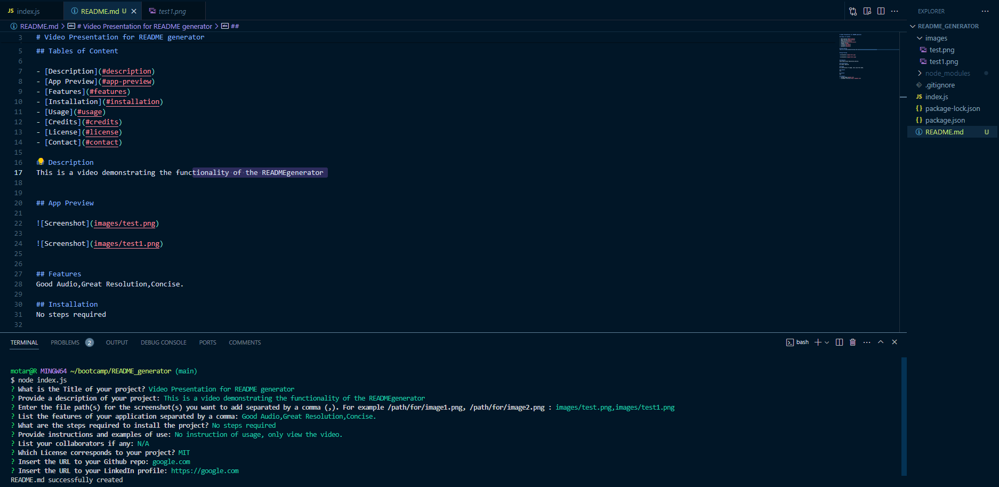

# Professional README generator
    
## Tables of Content

- [Description](#description)
- [App Preview](#app-preview)
- [Features](#features)
- [Installation](#installation)
- [Usage](#usage)
- [Credits](#credits)
- [License](#license)
- [Contact](#contact)

## Description
This app makes use of Inquirer package and the Filesystem functionality to prompt the user to answer some questions and generates a README.md file.


## App Preview
    

    

## Features
- Dynamic Generation
- Interactive Command-Line Interface
- Screenshot inclusion
- Markdown Formatting

## Installation
1. Make sure you have [Node](https://nodejs.org/) installed on your system.
2. Clone the repository to your local machine using Git
    ```Git
        git clone https://github.com/yourusername/readme-generator.git
    ```
3. Navigate to the application directory 
    ```Git
        cd readme-generator
    ```
4. Install dependencies using: 
     ```Git
        npm install
    ```
5. Run the application:
     ```Git
        node index.js
    ```

## Usage
1. Start the application.
2. Answer the prompts.
3. Review the Generated README

## Credits
N/A

# License
MIT

## Contact
- [GitHub Repo](https://github.com/ralphmolu)
- [LinkedIn Profile](www.linkedin.com/in/ralph-molu)
